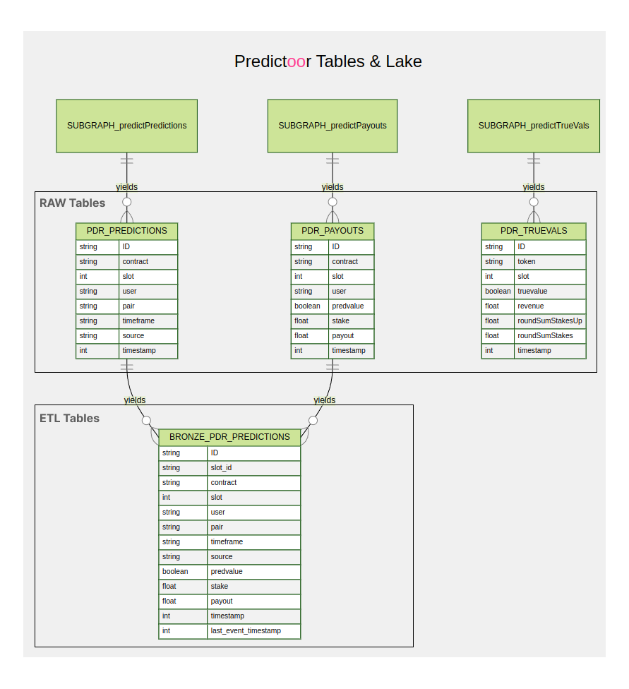
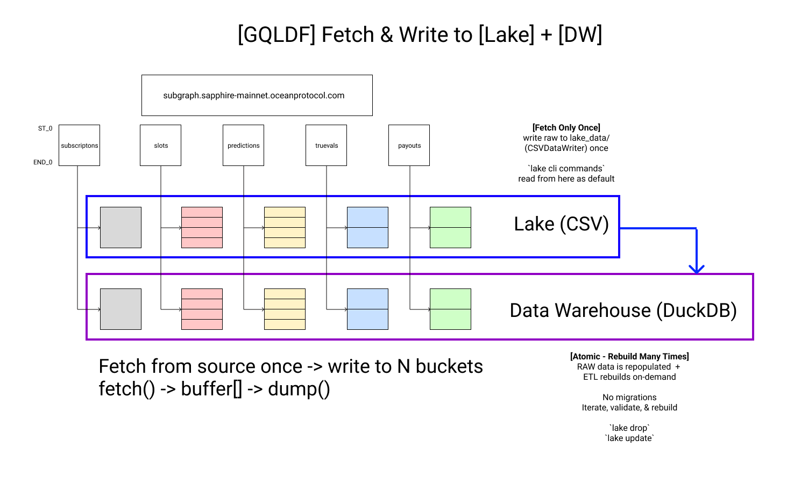
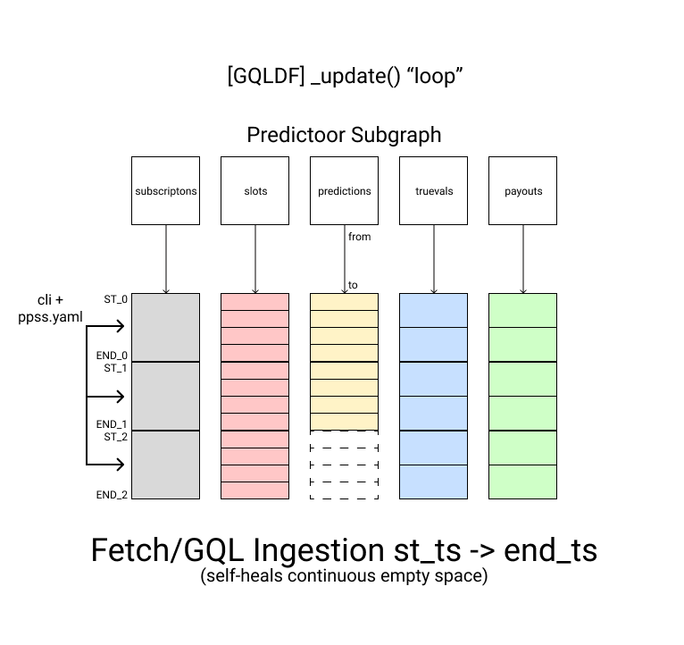
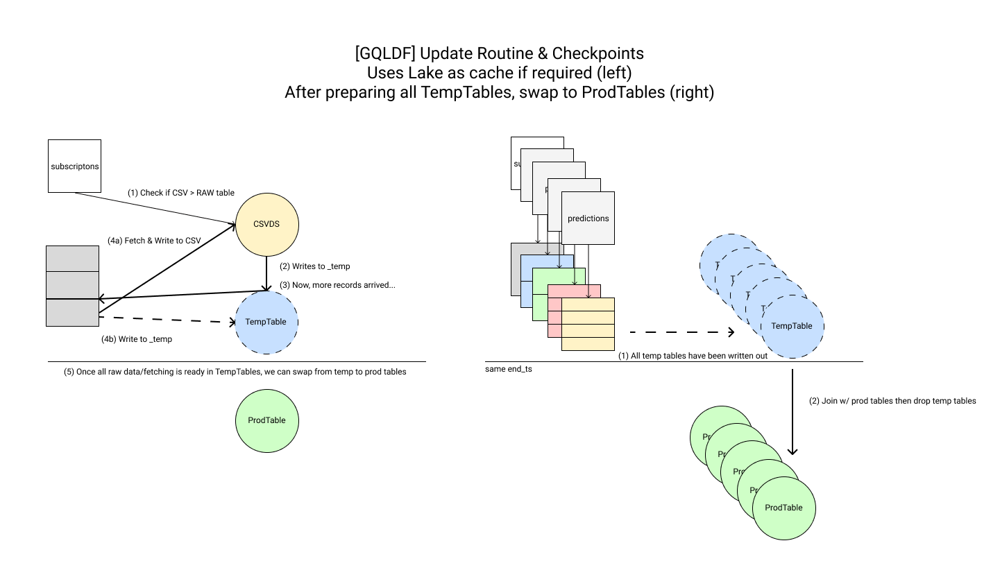
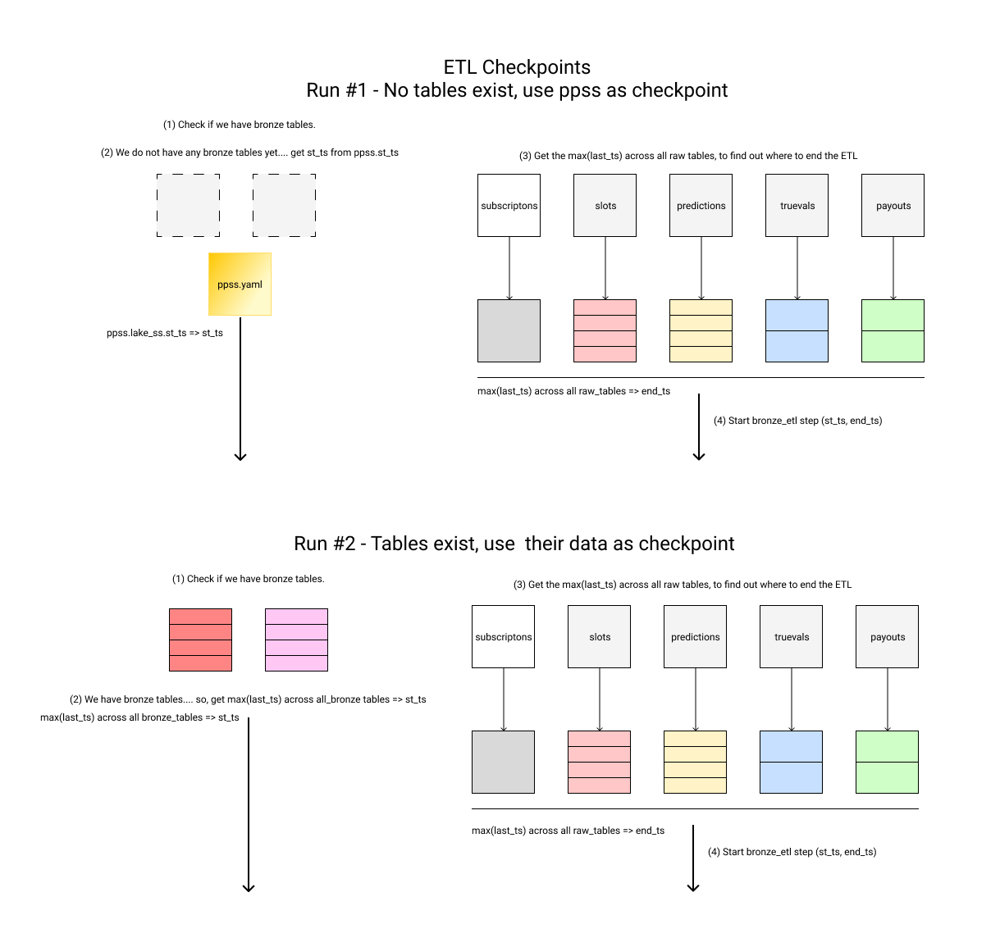

<!--
Copyright 2024 Ocean Protocol Foundation
SPDX-License-Identifier: Apache-2.0
-->

# Lake & ETL Overview

This README describes how you can operate the lake and use analytics to understand the world of predictoor.

First, we want to make sure we get all the data we'll need! Then, we'll process this data so it's easy to chart and understand things.

To complete this we'll be interacting different components in our stack, such as the: Lake, GQLDataFactory, and the ETL.


## Content
- [**ETL Tables & Architecture**](#etl-tables--architecture)
- [**Lake - "Storage"**](#lake---storage)
- [**GQL Data Factory & RAW**](#gql-data-factory--raw-data)
- [**Data Warehouse - "Database"**](#data-warehouse---database)
- [**ETL**](#etl)
- [**Checkpoints**](#checkpoints)
- [**Dumb Components**](#dumb-components)
- [**Export to parquet files**](#export-to-parquet-file)
- [**Examples**](#examples)
- [**Dos and Don'ts**](#dos-and-donts)


## ETL Tables & Architecture
To provide summaries on Predictoor users and systems, we want to fetch all new data and make it available for analysis.

The GraphQL Data Factory & ETL helps us achieve this by breaking the process down into 3 steps.
1. Ingesting + Loading Data - GQLDataFactory
1. Processing the data - ETL
1. Describing, visualization, and querying the data

The following diagram presents the ETL tables and workflow. Please maintain the [diagram](diagrams/lake.html) and image so they are up-to-date.




## Lake - "Storage"
For most users, the lake can simply be thought of disk storage.

It keeps all records stored as a timeseries CSV with a max number of records, where you can search and sample sections of the data if required.

In python, the lake (raw) data can be accessed via CSVDataStore (a CSV wrapper) and the CLI Lake module (cli_module_lake.py).

As a user, you can operate the lake via the CLI command: `pdr lake raw update ppss.yaml sapphire-mainnet`

Some features include:
1. The lake has a few commands: `describe`, `validate`, `update`, `drop`, and `query`
1. The lake is made up of many timeseries objects that should exist from `lake_ss.st_ts` and `lake_ss.end_ts`.
1. All the data inside lake folders should exist between `st_ts` and `end_ts`.
1. The `st_ts` and `end_ts` checkpoints come from `ppss.yaml` and the `lake_ss` component.
1. You can set `st_ts` and `end_ts` to relative times ("3 hours ago" -> "now"), so new records are always fetched and processed.
1. The lake is designed so raw data is fetched only once from subgraph and then saved into `lake_data/` and DuckDB.

**Note:** The lake currently does not support backfilling. If you need to, drop all data, adjust `st_ts` and `end_ts`, and then fetch again.




## GQL Data Factory & Raw Data
Is responsible for running a series of graphql fetches against subgraphs and then saves this raw data against 1->N buckets. 

GQLDF features a buffer, and will write out records as they arrive. Because ingesting is expensive, we use this routine to write it to (local) disk as CSVs, an into our (local) Data Warehouse (DuckDB).

When the GQL Data Factory updates, it looks at each query and their respective `lake_data/` folder to figure out where to resume from. Once all data has been fetched and loaded into `lake_data/` and the Data Warehouse (DuckDB), the update routine ends.

**Note:** The lake is designed to only be filled once. By default GQL Data Factory will not delete data from `lake_data/`.

**[DX-Self-Healing Lake]**

If you delete RAW CSV data sequentially from the end, i.e. "drop_tail()" then GQLDF will attempt to self-heal and simply fill in the data that it's missing.



**[DX-How to clear your Lake and start from scratch]**
1. Delete the `lake_data` folder
```console
sudo rm -r lake_data/
```

2. Fetch the raw data (if required, update `st_ts` and `end_ts`)
```console
pdr lake raw update ppss.yaml sapphire-mainnet
```

## Data Warehouse - "Database"
For most users, the Data Warehouse (DuckDB) is just a database.

To deliver a complete data stack capable of storing, processing, and enriching all of our data, we load all CSVs (lake) into DuckDB (DW) and then process this data through a series of SQL queries (ETL) inside the DW.

Currently, the DW (DB) can be accessed via the DuckDBDataStore (DuckDB Wrapper) and operated with via the CLI module `lake` commands `pdr lake etl update ppss.yaml sapphire-mainnet` (cli_module_lake.py)

Some features include:
1. The DW is atomic and designed to be destroyed/rebuilt by leveraging raw data from `lake_data`. There are no migrations.
1. To rebuild the DW, please use a combination of `lake etl drop` and `lake etl update` commands.
1. The DW is rebuilt using a series of SQL queries that Extract-Transform-Load (ETL) into new tables.
1. All ETL SQL queries run on DuckDB and follow a "mini-batch" routine to be as efficient as possible.
1. ETL tables use a "Medallion Achitecture" (bronze, silver, gold) to deliver a structured ETL architecture.
1. All the data inside ETL tables exist between `st_ts` and `end_ts`.

**Note:** All ETL is done on the DW to be efficient and future-proof ourselves towards distributed DBs. Do not jump between python -> sql -> python, this is computationally and memory expensive. All queries are designed to function as mini-batch opeations to reduce the amount of scans, joins, inserts, and updates.

**[DX-How to clear your Data Warehouse without clearing your lake]**
1. Drop all records from the Data Warehouse
```console
pdr lake raw drop ppss.yaml sapphire-mainnet 2020-01-01
pdr lake etl drop ppss.yaml sapphire-mainnet 2020-01-01
```

2. Fetch if needed, load from lake, and run the full ETL pipeline
```console
pdr lake etl update ppss.yaml sapphire-mainnet
```


## ETL
Is responsible for running a series of queries that transform and enrich the data so it can provide standard calculations accuately and valuable insights more readily.

### Update from CLI
From the cli - `pdr lake etl update ppss.yaml sapphire-mainnet`

### Data Flow
As you are developing and building around the data and lake, you might need to update how the system works, and be able to follow this workflow.
1. GQLDF completes succesfully. Fetch from source RAW => into CSV & DuckDB.
1. ETL runs SQL queries over the RAW data to clean it, join w/ other tables, transform => into Bronze Tables
1. Aggregating + Summarizing it => into Silver & Gold tables.
1. Serving this data into dahboards and other locations.

### Workflow
As you are developing and building around the lake, your workflow migh look like this.
1. Writing & Updating ETL code
1. Dropping ETL tables via CLI
1. Rebuilding ETL tables via CLI

### Limitations
1. No backfilling data before `st_ts`. If you want to backfill drop all records or select a new `lake_path`.

## Checkpoints
In order to only process new data, we want to "maintain a checkpoint" that helps us know where to start/resume from.

The simplest way to do this is to use the first and last event timestamps from our data.

### GQL Data Factory
All CSVs should be in-sync... with nearly the same [st_ts => end_ts] across all folders.
1. GQLDF fetches [st_ts => end_ts] from CSVs if available so it can resume, otherwise it uses ppss.yaml `st_ts`
1. For each GQL, we fetch all records [st_ts => end_ts] and save them as they arrive
1. Write raw data to CSV [st_ts => end_ts]
1. Write raw data to DW [st_ts => end_ts]



### ETL
All ETL tables should be in-sync with nearly the same [st_ts => end_ts].
1. ETL looks at CSV and ETL Tables last_records to identify how to resume, otherwise it uses ppss.yaml.
1. ETL first processes RAW records, before building ETL records/tables 
1. RAW records are processed into NewEvents (INSERT) and UpdateEvents(UPDATE) and stored in temporary tables: [TempTable] & [TempUpdateTable].
1. NewEvents and UpdateEvents are used to yield/update ETL tables.
1. ETL tabels follow a "Medallion Architecture": bronze, silver, gold



**Exceptions to the rule**
This doesn't always have to be the case.
1. RAW + ETL records could have been dropped.
2. CSV + GQLDF could be far ahead.

**[DX-How to resolve checkpoint and data problems]**
1. Run `describe` and `validate` to make sure there are no errors.
2. Drop all RAW + ETL Tables from DW and rebuild the DW from scratch.
3. RAW Tables are rebuilt from CSV records.
4. ETL Tables are rebuilt from RAW tables.

All systems [GQLDF + ETL + CSV + DuckDB] should be working out-of-the-box by using ppss.yaml & the cli.


## Examples & How To's

### Run Lake end to end

1. Fetch the data and create the Lake with **RAW** and **ETL** data
```console
pdr lake etl update ./ppss.yaml sapphire-mainnet
```
2. Validate the Lake
```console
pdr lake validate ./ppss.yaml sapphire-mainnet 
```
3. Inspect the Lake
```console
pdr lake describe ./ppss.yaml sapphire-mainnet 
```
4. Query data from the Lake
```console
pdr lake query ./lake_data "SELECT * FROM pdr_predictions"
```


### Modify Lake data
5. Drop data from the Lake at **ETL** level starting from a specified date
```console
pdr lake etl drop ppss.yaml sapphire-mainnet 2024-01-10
```

6. Drop data from the Lake at **RAW** level starting from a specified date
```console
pdr lake raw drop ppss.yaml sapphire-mainnet 2024-01-10
```

7. Recover data at **RAW** level starting from a specified date
```console
pdr lake raw update ppss.yaml sapphire-mainnet
```

8. Recover data at **ETL** level starting from a specified date
```console
pdr lake etl update ppss.yaml sapphire-mainnet
```

9. Validate the Lake
```console
pdr lake validate ppss.yaml sapphire-mainnet 
```

## DO'S and DONT'S
**Don't**:
 - !! Don't modify the CSV files in any way, otherwise data is going to be eronated !!

**Do's**:
 - If data is eronated or there is any issue with the Lake, reset the lake
 - Reset the Lake by deleting `lake_data/` folder
 - Recreate the Lake by running `lake raw update` and `lake etl update` commands


## "Dumb" Components
Lake components should be self-contained, "dumb", and perform one role.

GQLDF is upstream from ETL and does not have any knowledge of it. Do not create dependencies where there are none. I.E. If you delete CSV data from `lake_data`, do not expect this change to be reflected in RAW or ETL tables. Similarly, ETL should assume that GQLDF is performing it's role as expected.

Rather, help improve the lake validation and CLI tools to improve the lake DX and operations. Think about the entry points, validations, and [how to improve the user flow](https://github.com/oceanprotocol/pdr-backend/issues/1087#issuecomment-2155527087) so these checks being done outside core systems, once, while remaining user friendly.

## Export to parquet files
By default, the ETL process exports DuckDB lake data into Parquet files stored in the exports directory. This setup allows the dashboard to read the data without interfering with the direct connection to the lake.

The process of exporting is done periodically at a specified `seconds_between_parquet_exports` frequency inside `PPSS.yaml` config file and can be changed to the user needs.

To nuke and re-export parquet files for periodical cleanups, the `number_of_files_after_which_re_export_db` it's used, and can be easily configured.

Additionally, the export process can be disabled entirely by setting `export_db_data_to_parquet_files = False` in the configuration file.