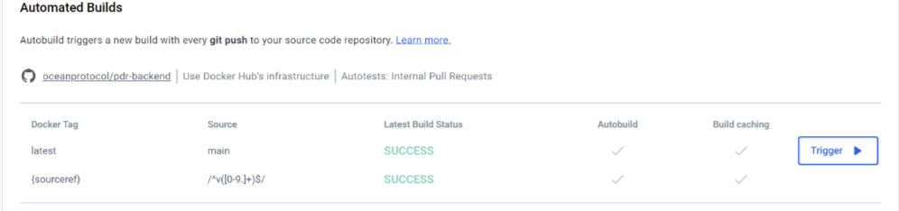
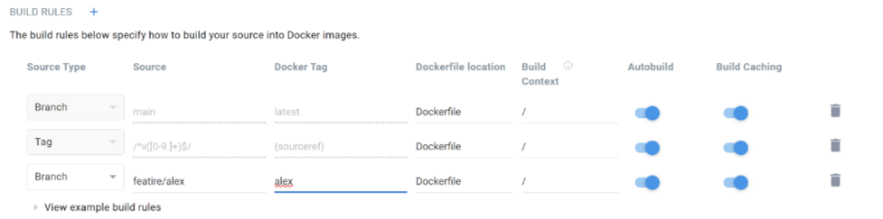

<!--
Copyright 2023 Ocean Protocol Foundation
SPDX-License-Identifier: Apache-2.0
-->

**Contents**

- [Release Process (main)](#release-process-including-docker)
- [About PyPi](#about-pypi)
- [About Docker](#about-docker)

# Release Process, including Docker

## Step 1: Update documentation

Update [docs repo](https://github.com/oceanprotocol/docs) if your changes affect docs.oceanprotocol.com content.

## Step 2. Publish new "Github Release" & Docker image

To create a new release for pdr-backend, follow these steps:

1. Visit [pdr-backend Github Releases](https://github.com/oceanprotocol/pdr-backend/releases). Note the current version number, eg `v0.1.4`. It follows [semantic versioning](https://semver.org/).
1. Decide a new version number, by incrementing patch (eg `v0.1.5`), minor (eg `v0.2.0`), or major (eg `v1.0.0`). Major is rare.
1. Click "Draft a new release".
1. For tag version, put something like `v0.1.5`.
1. For release title, put the same value (like `v0.1.5`).
1. For the target, select the `main` branch, or the most recent commit in main.
1. Describe the main changes. You can auto-generate a first cut following [these instructions](https://docs.github.com/en/repositories/releasing-projects-on-github/automatically-generated-release-notes), step 8.
1. Click "Publish release."

What happens then:
- The pdr-backend Github Releases Page will now include this release
- CI/CD will automatically build and publish a **new Docker image** with the release tag, making it available for installation and use.

# About PyPi

The release process does not include publishing to pypi.
- This is because we have explicitly _not_ put pdr-backend into pypi yet. It's not meant to be used as a library yet. In time, it likely will. Just not yet.

# About Docker

### Docker releases from main

> CI/CD will automatically build and publish a **new Docker image**

To elaborate: we have an automated docker build for pdr-backend `main` branch and for all releases. Github is already connected to dockerhub.



### Adding Docker branches

If you want to add Docker branches, go to https://hub.docker.com/repository/docker/oceanprotocol/pdr-backend/builds/edit

Then: on "Build rules", add your branch. Below is an example, where Alex is building "pdr-backend: alex" from branch "feature/alex".



In the last line: you should be able to log in with your username (eg trentmc).

### Testing Docker images

We recommend local testing (versus adding more to dockerhub). Here's how.

First, build your image locally with a custom label, eg `yaml-cli2`.

```console
cd ~/code/pdr-backend
docker build . -t 'oceanprotocol/pdr-backend:yaml-cli2' .
```

Then, start barge, using the custom label:
```console
cd ~/code/barge
export PDR_BACKEND_VERSION=yaml-cli2
./start_ocean.sh ...<the usual>...
```

Then, from pdr-backend, use barge as usual.

Pros of local testing:

- don't pollute dockerhub with one time images
- no need of cleanups. If a PR is merged, we don't need to delete that branch from dockerhub autobuild.
- no need of access to dockerhub
- dockerhub should be used for production ready images only

### Barge flow of calls

[See here](barge-calls.md)
